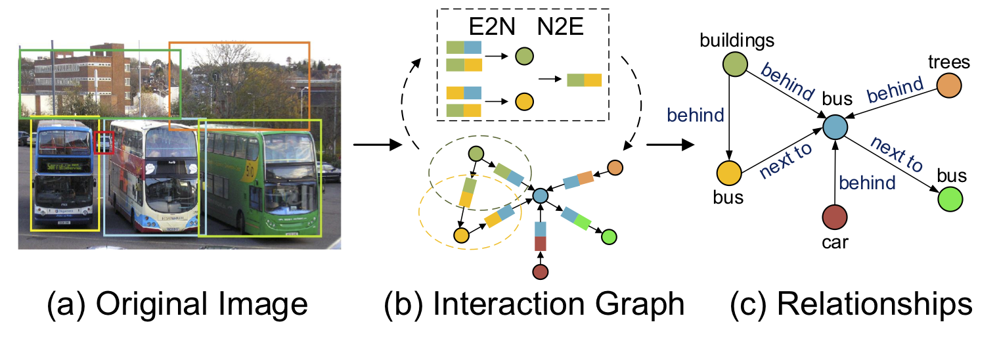

# Neural Message Passing for Visual Relationship Detection
This repository contains the official PyTorch implementation of:

**Neural Message Passing for Visual Relationship Detection** 
Yue Hu, Siheng Chen, Xu Chen, Ya Zhang, Xiao Gu

### [paper](https://users.ece.cmu.edu/~sihengc/paper/19_ICMLW_HuCCZ.pdf), [code](https://github.com/PhyllisH/NMP)



**Abstract:** Visual relationship detection aims to detect the interactions between objects in an image; however, this task suffers from combinatorial explosion due to the variety of objects and interactions. Since the interactions associated with the same object are dependent, we explore the dependency of interactions to reduce the search space. We explicitly model objects and interactions by an interaction graph and then propose a message-passing-style algorithm to propagate the contextual information. We thus call the proposed method neural message passing (NMP). We further integrate language priors and spatial cues to rule out unrealistic interactions and capture spatial interactions. Experimental results on two benchmark datasets demonstrate the superiority of our proposed method.

## Requirements
- Pytorch 0.4.0
- Tensorflow 1.3.0
- Python 3.6

## Data Preparation

1. Download VRD and VG dataset and pretrained faster-rcnn checkpoints from [STA[3]](https://share.weiyun.com/55KK78Y) (We follow their datasplit.)
2. Download meta data from [Baidu Yun](https://pan.baidu.com/s/1u-T9Tfj_0tO6KocZSAdFAw) extract code: ws3r 


## Data Preprocessing
### 1. Extract and save visual appearance
Here we use vrd dataset and predicate detection as example.

- `CUDA_VISIBLE_DEVICES=0 python extract_vgg_feature.py --dataset=vrd --data_type=pred`

### 2. Save the data path into roidb file

- ` python process.py --dataset=vrd --data-type=pred`

**The final folder should be**

```
├── dataset
    ├── vrd
      ├── sg_dataset
      ├── sg_test_images
      ├── sg_train_images
    ├── vg
      ├── VG_100K
└── data
    └── pretrained
    ├── vrd/vg_objects_vec.npy
    ├── vrd/vg_roidb.npz
    ├── vrd/vg_rela_roidb.npz
    ├── vrd/vg_pred_graph_roidb.np
    ├── vrd/vg_rela_graph_roidb.np
    └── vrd/vg_so_prior.npy
└── checkpoints
├── DataLoader.py
├── eval_metrics.py
├── modules.py
├── train_vg.py
├── train_vrd.py
├── utils.py
└── visualize.py
```

## Train and test phases

```
# train 
CUDA_VISIBLE_DEVICES=0 python train_vrd.py --encoder=nmp --use-loc --mode=whole --feat-mode=full
# eval
CUDA_VISIBLE_DEVICES=0 python train_vrd.py --encoder=nmp --use-loc --mode=eval --feat-mode=full --restore --load-folder=exp0
```

## Citation

```
@inproceedings{HuCCZG:19,
  author    = {Yue Hu, Siheng Chen, Xu Chen, Ya Zhang, Xiao Gu},
  title     = {Neural Message Passing for Visual Relationship Detection},
  booktitle = {ICML Workshop on Learning and Reasoning with Graph-Structured Representations},
  year      = {2019},
  month = {June},
  address = {Long Beach, CA}
}
```

## References

1. VRD Dataset: [https://cs.stanford.edu/people/ranjaykrishna/vrd/](https://cs.stanford.edu/people/ranjaykrishna/vrd/)
2. Visual Gnome:  [https://visualgenome.org](https://visualgenome.org/)
3. STA and VtransE Tensorflow type: [https://github.com/yangxuntu/vrd](https://github.com/yangxuntu/vrd)
4. Faster rcnn code: [https://github.com/endernewton/tf-faster-rcnn](https://github.com/endernewton/tf-faster-rcnn)
5. NRI code: [Neural Relational Inference for Interacting Systems](https://github.com/ethanfetaya/NRI)

## Contact

If you have any problem with this code, please feel free to contact **18671129361@sjtu.edu.cn**.

